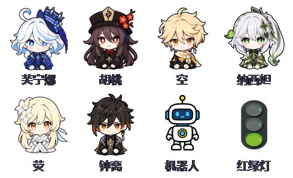
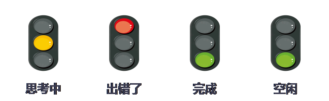

<h1 align="center">dsh-pet-StatusLight</h1>

<p align="center"><b>给 DeepSeek Harness 配一个会说话的桌面宠物。</b></p>

<p align="center">
  <a href="./README.md">English</a> ·
  <a href="./README.zh.md">中文</a>
</p>

<p align="center">
  <a href="https://www.npmjs.com/package/dsh-pet-statuslight"></a>
  <a href="LICENSE"></a>
  <a href="https://github.com/kongchengavg/dsh-pet-StatusLight"></a>
  <a href="https://github.com/kongchengavg/dsh-pet-StatusLight/issues"></a>
  <a href="INSTALL.md"></a>
  <a href="https://github.com/kongchengavg/dsh-pet-StatusLight/tree/main/assets/characters"></a>
</p>

模型思考、出错、完成任务时，角色表情实时切换；完成、出错、向你提问时，角色头顶弹出专属聊天框，点一下还能跳到对应会话。就算浏览器最小化了也不怕——系统级置顶小窗继续陪着你。

## 预览

<p align="center">
  
  <br><em>九位角色，右键随时切换</em>
</p>

<p align="center">
  
  <br><em>状态灯：思考 / 出错 / 完成 / 空闲 表情自动切换</em>
</p>

<p align="center">
  
  <br><em>任务完成、出错、提问时弹出角色专属聊天框</em>
</p>

## 交流

欢迎提 [issue](https://github.com/kongchengavg/dsh-pet-StatusLight/issues/new/choose) 反馈 bug、建议或使用问题。

## 亮点及功能

- 🐾 **9 个角色桌面宠物**：芙宁娜、胡桃、空、纳西妲、枫原万叶、荧、钟离、红绿灯、机器人；右键随时切换，选择自动记住。
- 🎭 **表情实时跟随**：思考、出错、完成、空闲四种状态对应四套表情；出错优先显示，结束后自动恢复。
- 💬 **角色专属聊天框**：任务完成、出错、向你提问时弹出气泡提示，点「查看详细」直接跳到对应会话。
- 🪟 **系统级置顶小窗**（Windows）：独立于浏览器的透明小窗，浏览器最小化也照常显示；可拖动、可右键切换角色，异常退出自动重连。

## 安装

**方法一：交给 AI（将以下文字复制并发给 AI）**

> 「按照 https://github.com/kongchengavg/dsh-pet-StatusLight/ 的 INSTALL.md 安装该插件」

**方法二：手动安装**

- **静态安装** —— 已发布到 npm，一行命令安装：

  ```sh
  dsh plugin --profile web add dsh-pet-statuslight          # npm 一键安装
  # 或 GitHub 源：
  dsh plugin --profile web add git+https://github.com/kongchengavg/dsh-pet-StatusLight.git
  ```

  重启 dsh web 后插件自动加载。

## 用法

- **右键**状态灯或小窗：切换角色 / 打开主界面 / 关闭置顶小窗。
- **左键拖动**小窗：移动位置（自动保存）。
- **聊天框**：点「查看详细」跳到对应会话；点「×」立即关闭；60 秒后自动消失。
- 角色与位置等配置保存在工作区 `.statuslight.json`，可手动编辑。

## 免责声明

本项目按现状提供，作者不对任何特定用途（含商业使用）提供保证或背书。角色图片素材版权归原作者所有，仅供个人学习使用，请自行确认使用许可。本项目为社区开源项目，与 DeepSeek、米哈游等官方无关。

## License

代码部分采用 MIT（见 [LICENSE](LICENSE)）；角色图片素材版权归原作者所有。
